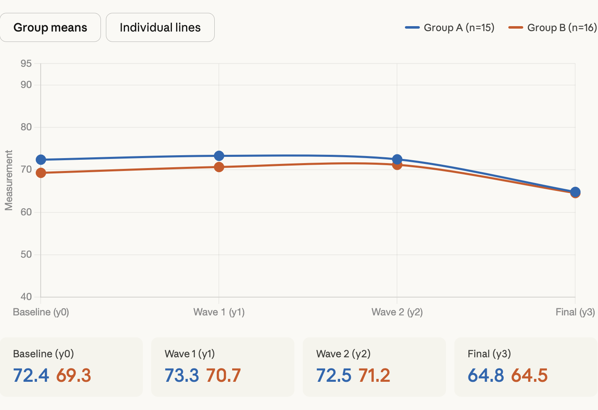
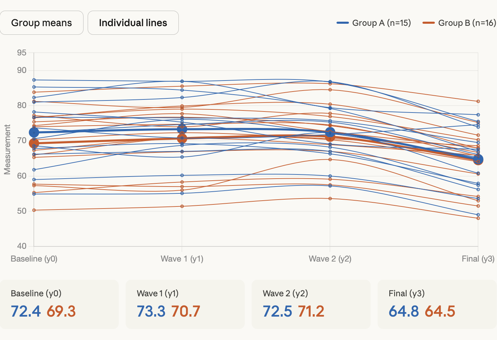

```{r}
#| label: setup
#| include: false

library(tidyverse)
library(knitr)
library(kableExtra)
```

# Busiest Airports Analysis

## Data Overview

For this section I looked at annual passenger traffic at six major airports from 2020 to 2025. The airports I picked are Hartsfield-Jackson Atlanta (ATL), Frankfurt (FRA), Beijing Daxing (PKX), Dubai International (DXB), Los Angeles International (LAX), and London Heathrow (LHR). They're spread across four continents so it gives a pretty good picture of how air travel has changed globally over the past few years. All the numbers are in millions of passengers and I pulled them from airport statistics reports and Wikipedia.

```{r}
#| label: airports-data

airport_data <- tibble(
  airport = rep(c("ATL", "FRA", "PKX", "DXB", "LAX", "LHR"), each = 6),
  name = rep(c("Hartsfield-Jackson Atlanta", "Frankfurt Airport",
               "Beijing Daxing", "Dubai International",
               "Los Angeles International", "London Heathrow"), each = 6),
  year = rep(2020:2025, times = 6),
  passengers_M = c(
    42.9, 75.7, 93.7, 104.7, 108.1, 106.3,
    18.8, 24.8, 48.9, 59.4,  61.6,  63.2,
    16.0, 25.7, 17.5, 39.4,  52.0,  53.6,
    25.9, 29.1, 66.1, 86.9,  92.3,  95.2,
    28.8, 41.9, 65.9, 75.0,  76.6,  73.7,
    22.1, 19.4, 61.6, 79.2,  83.9,  84.5
  )
)
```

```{r}
#| label: tbl-airports
#| tbl-cap: "Annual Passenger Traffic (Millions) at Six Major Airports, 2020--2025"

airport_data |>
  select(airport, name, year, passengers_M) |>
  pivot_wider(names_from = year, values_from = passengers_M) |>
  rename(Airport = airport, Name = name) |>
  kable(digits = 1, align = c("l", "l", rep("r", 6))) |>
  kable_styling(latex_options = c("hold_position", "scale_down"),
                font_size = 10) |>
  column_spec(1, bold = TRUE)
```

## Visualization

```{r}
#| label: fig-airports
#| fig-cap: "Annual passenger traffic at six of the world's busiest airports, 2020--2025. Each line represents one airport; figures in millions of passengers. Source: Wikipedia."
#| fig-width: 8
#| fig-height: 5

airport_data |>
  filter(!is.na(passengers_M)) |>
  ggplot(aes(x = year, y = passengers_M, color = airport)) +
  geom_line(linewidth = 0.9) +
  geom_point(size = 2.2) +
  scale_color_brewer(palette = "Set1") +
  scale_x_continuous(breaks = 2020:2025) +
  scale_y_continuous(breaks = seq(0, 120, by = 30)) +
  labs(
    title = paste0("Annual Passenger Traffic at Six of the ",
                   "World's Busiest Airports"),
    subtitle = "2020\u20132025 | Figures in millions | Source: Wikipedia",
    x = "Year",
    y = "Passengers (Millions)",
    color = "Airport"
  ) +
  theme_minimal() +
  theme(
    plot.title = element_text(face = "bold", size = 14),
    plot.subtitle = element_text(size = 10, color = "gray40"),
    legend.position = "right"
  )
```

## Analysis

The first thing you notice when looking at @tbl-airports and @fig-airports is just how bad 2020 was for every single airport. Atlanta went from normally handling over 100 million passengers down to 42.9 million. Heathrow dropped to 22.1 million and Frankfurt was even worse at 18.8 million. On the chart you can literally see all six lines nosedive in 2020, which really puts into perspective how much COVID messed up global air travel.

But what I found more interesting than the crash itself is how differently each airport bounced back. Dubai is the wild one here. It went from 29.1 million in 2021 all the way up to 86.9 million by 2023, which is a crazy fast recovery. By 2025 it hit 95.2 million, a new record for them. I think this has a lot to do with Dubai being such a big international hub---when borders opened back up, all the connecting traffic came rushing back. Atlanta recovered fast too and got back over 100 million by 2023, but here's the thing: it actually went down a bit in 2025 to 106.3 million after peaking at 108.1 in 2024. So it looks like ATL might be hitting some kind of ceiling, maybe because it depends so much on domestic flights.

LAX is the other airport that went down in 2025, dropping from 76.6 to 73.7 million. I'm not totally sure why---could be airlines shifting routes around or just changes in demand. Meanwhile Heathrow kept going up and set a new all-time record at 84.5 million in 2025, so it's not like air travel is declining everywhere.

The weirdest pattern in the data is definitely Beijing Daxing. When you look at the chart, every other airport's line is going up through 2021 and 2022 but PKX actually goes down. The table shows it dropped from 25.7 million to 17.5 million in 2022, which doesn't make sense until you remember China had the zero-COVID lockdowns going on. Once those ended, PKX shot back up and reached 53.6 million by 2025, but it's still way behind the others in terms of total volume.

Frankfurt is kind of just... fine. It recovered to 63.2 million in 2025 but that's still like 10% below where it was before the pandemic. Compared to how fast Dubai or even Atlanta bounced back, Frankfurt's trajectory looks flat. It feels like there's something structural going on there, not just a slow recovery.

\newpage

# Monte Carlo Numerical Integration

## Method Overview

Monte Carlo integration is basically a way to estimate the area under a curve by throwing random points at it. You set up a rectangle that contains the function, generate a bunch of random (x, y) points inside that rectangle, and then count how many land below the curve versus above it. The proportion of points below the curve times the area of the rectangle gives you an estimate of the integral. More points = better estimate, at least in theory.

The function I'm working with here is the Chi-squared PDF with df = 5, and I'm integrating it over $0 \le x \le 20$ with $y \in [0, 0.16]$. The rectangle has area $20 \times 0.16 = 3.2$. I wrote a function called `generate_mcPoints()` that creates the random sample, and then a plotting function that colors the points based on whether they fall above or below the curve.

```{r}
#| label: mc-setup
#| include: false

generate_mcPoints <- function(n, x_min, x_max, y_min, y_max) {
  data.frame(
    x = runif(n, min = x_min, max = x_max),
    y = runif(n, min = y_min, max = y_max)
  )
}

make_mc_plot <- function(n, seed_val) {
  set.seed(seed_val)
  mc_data <- generate_mcPoints(n, 0, 20, 0, 0.16) |>
    mutate(flag = if_else(y > dchisq(x, df = 5), "above", "on/below"))

  rect_area <- 20 * 0.16
  estimate  <- round(rect_area * mean(mc_data$flag == "on/below"), 4)

  ggplot(mc_data, aes(x = x, y = y, color = flag)) +
    geom_point(alpha = 0.6, size = 1.2) +
    stat_function(fun = dchisq, args = list(df = 5), xlim = c(0, 20),
                  color = "darkblue", linewidth = 1) +
    scale_color_manual(values = c("above" = "#C8102E", "on/below" = "#8DB600")) +
    labs(
      title = paste0("n = ", format(n, big.mark = ",")),
      subtitle = paste0("Estimate: ", estimate),
      x = "x", y = "y", color = NULL
    ) +
    theme_minimal(base_size = 10) +
    theme(legend.position = "bottom")
}
```

## Small Multiples Visualization

::: {#fig-mc layout-ncol=2}

```{r}
#| label: fig-mc-n10
#| fig-cap: "n = 10"
make_mc_plot(10, seed_val = 42)
```

```{r}
#| label: fig-mc-n100
#| fig-cap: "n = 100"
make_mc_plot(100, seed_val = 99)
```

```{r}
#| label: fig-mc-n1000
#| fig-cap: "n = 1,000"
make_mc_plot(1000, seed_val = 7)
```

```{r}
#| label: fig-mc-n10000
#| fig-cap: "n = 10,000"
make_mc_plot(10000, seed_val = 21)
```

Monte Carlo integration of the Chi-squared PDF (df = 5) at four sample sizes. Green points fall on or below the density curve; red points fall above it.

:::

## Analysis

@fig-mc has four panels showing the Monte Carlo simulation at n = 10, 100, 1,000, and 10,000. Each panel has the Chi-squared curve (df = 5) drawn in dark blue, with green dots for points that landed on or below the curve and red dots for points above. The subtitle on each panel shows what the estimated integral came out to.

At n = 10 (@fig-mc-n10) the estimate is basically a coin flip. There's so few points that the result is pretty much random and doesn't tell you much. When you bump up to n = 100 (@fig-mc-n100) you can start to kinda see the shape of the distribution forming---like the green points are clustering where the curve is, but it's still pretty rough. The n = 1,000 panel (@fig-mc-n1000) is where it starts to actually look good. You can see the green-red boundary lining up with the curve pretty well, and the estimate gets a lot closer to the true answer. Then at n = 10,000 (@fig-mc-n10000) the green area basically fills in the exact shape under the curve and the estimate is really close to 1.0.

The reason it converges to 1.0 is that the Chi-squared distribution (df = 5) is a probability density function, so by definition the total area under it has to equal 1. Since our rectangle goes from 0 to 20 on the x-axis and the Chi-squared PDF with df = 5 is basically zero past x = 20 anyway, we're capturing pretty much all of the density. So as you add more and more random points, the estimate should get closer and closer to 1. Looking across the four panels from top-left to bottom-right, you can literally watch this happen, which is kind of the whole point of the small multiples layout.

\newpage

# Planning and Prompting GenAI Tools

## Data Context

The calcium data is from a study that followed 31 women over four years. Researchers measured calcium levels in the ulna (forearm bone) of each woman's dominant arm using photon absorptiometry. 15 of the women were in a control group with no intervention, and the other 16 were put on a diet and exercise program. They took measurements every year: Initial (y0), Year 1 (y1), Year 2 (y2), and Year 3 (y3).

The CSV file is kind of a mess. It has 8 columns but the names are duplicated---y0, y1, y2, y3 appear twice. The first four columns are the control group and the last four are the diet/exercise group. There's no column telling you which group is which and no subject IDs either, so you have to figure that out from the column positions.

## My Plan for Tidying and Visualizing the Calcium Data

Before I opened up Claude I sat down and thought through what I actually needed to do with this data. Here's what I came up with:

**Goal:** Get the calcium data into tidy format and make a plot comparing calcium levels between the two groups over time.

**What's wrong with the data right now:**

The column names are duplicated so R can't tell them apart normally. The two groups are sitting next to each other in the same row instead of being stacked. Each row has data from two different women mixed together. And there's no subject ID or group label anywhere.

**My plan for fixing it:**

1. Read the CSV with `read_csv()` since it auto-renames duplicate columns, so all 8 columns stay intact.
2. Split by column position---grab columns 1-4 for the control group and 5-8 for the diet/exercise group.
3. Give each woman a subject ID (like N1, N2... for control and E1, E2... for exercise) and add a group label.
4. Rename the time columns to something readable: Initial, Year1, Year2, Year3.
5. Use `pivot_longer()` on each group to go from wide to long format.
6. Stack both groups together with `bind_rows()`.
7. Get rid of NAs---the control group only has 15 women so row 16 will be empty.
8. Make a line plot with group means over time and add standard error bars so you can see the uncertainty.

**How I'll check my work:** After combining the groups, I should have around 120 rows (31 subjects times 4 time points minus the 4 NAs from the missing 16th control subject). The final plot should show whether the diet/exercise group's calcium levels diverge from the control group over time.

## Plan-Informed Visualization

I gave Claude (claude-opus-4-6) my plan along with the calcium.csv file on April 12, 2026. Here's the prompt I used and the code it generated:

**Prompt:**

> I have a calcium.csv file from a longitudinal study of 31 women over 4 years measuring ulnar calcium levels. The data has 8 columns with duplicate names (y0,y1,y2,y3 repeated twice). The first 4 columns are the null treatment group (15 women, no intervention) and the last 4 are the diet/exercise group (16 women). Here is my plan: (1) Read the CSV preserving all 8 columns despite duplicate names. (2) Separate into two groups by column position. (3) Add subject IDs and group labels. (4) Rename time columns to Initial, Year1, Year2, Year3. (5) Pivot each group to long format. (6) Combine into one tidy data frame. (7) Remove NAs. (8) Create a line plot comparing mean calcium over time by group with standard error bars. Please write R code using tidyverse to execute this plan.

```{r}
#| label: calcium-tidy

calcium_raw <- read_csv("calcium.csv", show_col_types = FALSE)

null_group <- calcium_raw |>
  select(1:4) |>
  set_names(c("Initial", "Year1", "Year2", "Year3")) |>
  mutate(Subject = paste0("N", row_number()),
         Group = "Null Treatment") |>
  filter(!if_all(Initial:Year3, is.na))

exercise_group <- calcium_raw |>
  select(5:8) |>
  set_names(c("Initial", "Year1", "Year2", "Year3")) |>
  mutate(Subject = paste0("E", row_number()),
         Group = "Diet/Exercise")

null_long <- null_group |>
  pivot_longer(cols = Initial:Year3,
               names_to = "TimePoint",
               values_to = "Calcium")

exercise_long <- exercise_group |>
  pivot_longer(cols = Initial:Year3,
               names_to = "TimePoint",
               values_to = "Calcium")

calcium_tidy <- bind_rows(null_long, exercise_long) |>
  mutate(TimePoint = factor(TimePoint,
                            levels = c("Initial", "Year1", "Year2", "Year3")))

calcium_tidy <- calcium_tidy |> drop_na(Calcium)

calcium_summary <- calcium_tidy |>
  group_by(Group, TimePoint) |>
  summarise(
    Mean = mean(Calcium),
    SD   = sd(Calcium),
    SE   = SD / sqrt(n()),
    .groups = "drop"
  )
```

```{r}
#| label: fig-calcium-plan
#| fig-cap: "Plan-informed visualization: Mean ulnar calcium levels over time by treatment group, with standard error bars. Generated by Claude using a detailed step-by-step plan."
#| fig-width: 7
#| fig-height: 4.5

ggplot(calcium_summary, aes(x = TimePoint, y = Mean,
                            color = Group, group = Group)) +
  geom_line(linewidth = 1.2) +
  geom_point(size = 3) +
  geom_errorbar(aes(ymin = Mean - SE, ymax = Mean + SE),
                width = 0.15, linewidth = 0.8) +
  scale_color_manual(values = c("Diet/Exercise" = "steelblue",
                                "Null Treatment" = "coral")) +
  labs(
    title = "Mean Ulnar Calcium Levels Over Time by Treatment Group",
    subtitle = "Error bars represent \u00b1 1 standard error",
    x = "Time Point",
    y = "Calcium Level (mg/cm\u00b2)",
    color = "Group"
  ) +
  theme_minimal() +
  theme(
    plot.title = element_text(face = "bold", size = 13),
    plot.subtitle = element_text(size = 10, color = "gray40"),
    legend.position = "bottom"
  )
```

The code Claude gave me followed my plan step by step. It handled the duplicate columns correctly, separated the groups, tidied everything, and made the plot I asked for with error bars and clear labels. Since I told it exactly what to do in the prompt, it didn't have to guess at the data structure.

## Generic Prompt Results

These next two figures come from the instructor-provided generic prompt output. The instructor gave Claude Sonnet 4.6 Extended (March 31, 2026) a basic prompt about the calcium data without any specific plan or instructions about how to handle the data structure.

```{r}
#| label: fig-generic-means
#| fig-cap: "Generic prompt output: Group means over time. Produced by Claude Sonnet 4.6 Extended using an unguided prompt provided by the instructor."
#| out-width: "85%"

```

```{r}
#| label: fig-generic-indiv
#| fig-cap: "Generic prompt output: Individual trajectories. Produced by Claude Sonnet 4.6 Extended using an unguided prompt provided by the instructor."
#| out-width: "85%"

```

## My Own Visualization

I also made my own plot to add a different angle that neither the plan-informed nor generic output really captured. Instead of just showing group averages, I wanted to see what every individual woman's calcium trajectory looked like, separated by group.

```{r}
#| label: fig-calcium-own
#| fig-cap: "Individual calcium trajectories faceted by treatment group. Each line represents one woman's measurements over the four time points."
#| fig-width: 8
#| fig-height: 4.5

ggplot(calcium_tidy, aes(x = TimePoint, y = Calcium,
                         group = Subject, color = Group)) +
  geom_line(alpha = 0.45, linewidth = 0.6) +
  geom_point(alpha = 0.55, size = 1.5) +
  facet_wrap(~ Group) +
  scale_color_manual(values = c("Diet/Exercise" = "steelblue",
                                "Null Treatment" = "coral")) +
  labs(
    title = "Individual Calcium Trajectories by Treatment Group",
    x = "Time Point",
    y = "Calcium Level (mg/cm\u00b2)"
  ) +
  theme_minimal() +
  theme(
    plot.title = element_text(face = "bold", size = 13),
    legend.position = "none",
    axis.text.x = element_text(angle = 30, hjust = 1)
  )
```

## Comparison: Plan-Informed vs. Generic vs. Own Work

So looking at the three sets of outputs side by side, there's a pretty clear difference in quality depending on how specific the prompt was.

My plan-informed output (@fig-calcium-plan) gave me exactly what I wanted. The code handled the duplicate column names right, the groups got proper labels ("Null Treatment" and "Diet/Exercise" instead of something generic), and the plot has error bars which makes it way easier to judge whether the group differences are real or just noise. I think this worked well because I told Claude specifically about the data structure and laid out each step, so it didn't have to make assumptions.

The generic prompt output (@fig-generic-means and @fig-generic-indiv) is okay but has some issues. The group means plot just calls them "Group A" and "Group B" which isn't super helpful if you're trying to interpret the results. There's also no error bars, so you're just looking at two lines and guessing whether the gap between them matters. The individual trajectories plot (@fig-generic-indiv) is actually a nice idea that shows more detail, but overall the generic output feels less polished and harder to work with.

For @fig-calcium-own I went with a faceted individual trajectory plot because I wanted to see the full picture that group averages hide. And yeah, there's a lot of variability. Some women in the control group actually gained calcium while some in the exercise group lost it. You'd never know this from either of the mean-line plots. I think having all three views together---group means with uncertainty, the generic version, and individual paths---gives you a much more complete understanding of this data than any single plot would.

The main takeaway for me is that spending time on the prompt really pays off. The plan-informed version was better in basically every way, and the generic one made decent-looking charts but missed important details that would have been easy to include with better instructions.

\newpage

# Reflection

This assignment was probably the most involved one we've done so far and it pulled together a lot of different things from the course. I'll try to break down what I actually learned from each part.

The airport section was good practice for the basics. Building the tibble, using `pivot_wider()` to make the table, making the line chart---that stuff I've done before. But writing the analysis is where it got harder. I had to really look at the data and figure out what story it was telling. Like I didn't expect ATL and LAX to actually go down in 2025, and the PKX dip in 2022 was something I only noticed because I had both the table and chart to compare. Having both @tbl-airports and @fig-airports next to each other made patterns way more obvious than either one alone.

The Monte Carlo part was honestly pretty cool conceptually. Like I understood the basic idea from lecture but actually coding it and watching the estimate get better from n = 10 to n = 10,000 in @fig-mc made it click in a different way. Writing the `generate_mcPoints()` function and using `set.seed()` so the results are reproducible was a useful exercise too. And figuring out Quarto's layout div for the small multiples was a bit annoying at first but the result looks way cleaner than if I'd tried to arrange the plots some other way.

The GenAI section was probably the most useful in terms of real-world skills. I went into it thinking that any halfway decent prompt would get good results. But comparing what I got from the planned prompt (@fig-calcium-plan) versus the generic output, the difference was obvious. The planned version nailed the data tidying and gave me exactly the viz I asked for. The generic version was fine but it missed stuff like proper group labels and error bars. It kind of drove home the point that you get out what you put in, which I guess applies to AI tools just like anything else.

Putting everything together in Quarto was also valuable. Having all the code embedded in the document with cross-references to the figures and tables means someone else could re-render the whole thing from scratch and get the same results. That's something I want to keep doing going forward.

\newpage

# Appendix A: GenAI Usage {.unnumbered}

This appendix documents all uses of generative AI tools in completing this assignment, following the course academic integrity policy.

**Usage 1: Plan-Informed Calcium Visualization (Section 3)**

- **Tool:** Anthropic Claude (claude-opus-4-6)
- **Date:** April 12, 2026
- **Purpose:** Generate R code to tidy the calcium dataset and create a group-means visualization based on my pre-written plan.
- **Exact prompt used:**

> I have a calcium.csv file from a longitudinal study of 31 women over 4 years measuring ulnar calcium levels. The data has 8 columns with duplicate names (y0,y1,y2,y3 repeated twice). The first 4 columns are the null treatment group (15 women, no intervention) and the last 4 are the diet/exercise group (16 women). Here is my plan: (1) Read the CSV preserving all 8 columns despite duplicate names. (2) Separate into two groups by column position. (3) Add subject IDs and group labels. (4) Rename time columns to Initial, Year1, Year2, Year3. (5) Pivot each group to long format. (6) Combine into one tidy data frame. (7) Remove NAs. (8) Create a line plot comparing mean calcium over time by group with standard error bars. Please write R code using tidyverse to execute this plan.

- **Exact response (code generated by Claude):** Claude returned R code that used `read_csv()` to read the CSV (which auto-renames duplicates), `select(1:4)` and `select(5:8)` to separate groups, `set_names()` to relabel time columns, `mutate()` to add subject IDs and group labels, `filter(!if_all(..., is.na))` to remove all-NA rows, `pivot_longer()` on each group, `bind_rows()` to combine, `drop_na()` to clean up, `group_by() |> summarise()` for means/SD/SE, and `ggplot()` with `geom_line()` + `geom_point()` + `geom_errorbar()` + `scale_color_manual()` for the final plot. The code is shown in the plan-informed visualization chunk in Section 3 and runs without errors.

**Usage 2: Generic Prompt Output (Instructor-Provided)**

- **Tool:** Anthropic Claude Sonnet 4.6 Extended
- **Date:** March 31, 2026
- **Purpose:** Instructor-provided baseline for comparison in the GenAI prompting exercise.
- **Prompt:** Generic prompt provided by instructor (not written by student).
- **Response:** Two visualizations were produced: a group means line plot (@fig-generic-means) and an individual trajectories plot (@fig-generic-indiv). These were provided as-is by the instructor for comparison purposes.

\newpage

# Appendix B: Code {.unnumbered}

All R code used in this document is shown below.

```{r}
#| label: code-appendix
#| echo: true
#| eval: false

# ============================================================
# SECTION 1: BUSIEST AIRPORTS ANALYSIS
# ============================================================

# --- Airport Data ---
airport_data <- tibble(
  airport = rep(c("ATL", "FRA", "PKX", "DXB", "LAX", "LHR"), each = 6),
  name = rep(c("Hartsfield-Jackson Atlanta", "Frankfurt Airport",
               "Beijing Daxing", "Dubai International",
               "Los Angeles International", "London Heathrow"), each = 6),
  year = rep(2020:2025, times = 6),
  passengers_M = c(
    42.9, 75.7, 93.7, 104.7, 108.1, 106.3,
    18.8, 24.8, 48.9, 59.4,  61.6,  63.2,
    16.0, 25.7, 17.5, 39.4,  52.0,  53.6,
    25.9, 29.1, 66.1, 86.9,  92.3,  95.2,
    28.8, 41.9, 65.9, 75.0,  76.6,  73.7,
    22.1, 19.4, 61.6, 79.2,  83.9,  84.5
  )
)

# --- Airport Table ---
airport_data |>
  select(airport, name, year, passengers_M) |>
  pivot_wider(names_from = year, values_from = passengers_M) |>
  rename(Airport = airport, Name = name) |>
  kable(digits = 1, align = c("l", "l", rep("r", 6))) |>
  kable_styling(latex_options = c("hold_position", "scale_down"),
                font_size = 10) |>
  column_spec(1, bold = TRUE)

# --- Airport Plot ---
airport_data |>
  filter(!is.na(passengers_M)) |>
  ggplot(aes(x = year, y = passengers_M, color = airport)) +
  geom_line(linewidth = 0.9) +
  geom_point(size = 2.2) +
  scale_color_brewer(palette = "Set1") +
  scale_x_continuous(breaks = 2020:2025) +
  scale_y_continuous(breaks = seq(0, 120, by = 30)) +
  labs(
    title = paste0("Annual Passenger Traffic at Six of the ",
                   "World's Busiest Airports"),
    subtitle = "2020\u20132025 | Figures in millions | Source: Wikipedia",
    x = "Year",
    y = "Passengers (Millions)",
    color = "Airport"
  ) +
  theme_minimal() +
  theme(
    plot.title = element_text(face = "bold", size = 14),
    plot.subtitle = element_text(size = 10, color = "gray40"),
    legend.position = "right"
  )

# ============================================================
# SECTION 2: MONTE CARLO NUMERICAL INTEGRATION
# ============================================================

# --- Helper Functions ---
generate_mcPoints <- function(n, x_min, x_max, y_min, y_max) {
  data.frame(
    x = runif(n, min = x_min, max = x_max),
    y = runif(n, min = y_min, max = y_max)
  )
}

make_mc_plot <- function(n, seed_val) {
  set.seed(seed_val)
  mc_data <- generate_mcPoints(n, 0, 20, 0, 0.16) |>
    mutate(flag = if_else(y > dchisq(x, df = 5), "above", "on/below"))

  rect_area <- 20 * 0.16
  estimate  <- round(rect_area * mean(mc_data$flag == "on/below"), 4)

  ggplot(mc_data, aes(x = x, y = y, color = flag)) +
    geom_point(alpha = 0.6, size = 1.2) +
    stat_function(fun = dchisq, args = list(df = 5), xlim = c(0, 20),
                  color = "darkblue", linewidth = 1) +
    scale_color_manual(values = c("above" = "#C8102E",
                                  "on/below" = "#8DB600")) +
    labs(
      title = paste0("n = ", format(n, big.mark = ",")),
      subtitle = paste0("Estimate: ", estimate),
      x = "x", y = "y", color = NULL
    ) +
    theme_minimal(base_size = 10) +
    theme(legend.position = "bottom")
}

# --- Monte Carlo Plots (called inside Quarto layout div) ---
# fig-mc-n10:    make_mc_plot(10, seed_val = 42)
# fig-mc-n100:   make_mc_plot(100, seed_val = 99)
# fig-mc-n1000:  make_mc_plot(1000, seed_val = 7)
# fig-mc-n10000: make_mc_plot(10000, seed_val = 21)

# ============================================================
# SECTION 3: CALCIUM DATA - PLAN-INFORMED VISUALIZATION
# ============================================================

# --- Tidy the Calcium Data ---
calcium_raw <- read_csv("calcium.csv", show_col_types = FALSE)

null_group <- calcium_raw |>
  select(1:4) |>
  set_names(c("Initial", "Year1", "Year2", "Year3")) |>
  mutate(Subject = paste0("N", row_number()),
         Group = "Null Treatment") |>
  filter(!if_all(Initial:Year3, is.na))

exercise_group <- calcium_raw |>
  select(5:8) |>
  set_names(c("Initial", "Year1", "Year2", "Year3")) |>
  mutate(Subject = paste0("E", row_number()),
         Group = "Diet/Exercise")

null_long <- null_group |>
  pivot_longer(cols = Initial:Year3,
               names_to = "TimePoint",
               values_to = "Calcium")

exercise_long <- exercise_group |>
  pivot_longer(cols = Initial:Year3,
               names_to = "TimePoint",
               values_to = "Calcium")

calcium_tidy <- bind_rows(null_long, exercise_long) |>
  mutate(TimePoint = factor(TimePoint,
                            levels = c("Initial", "Year1", "Year2", "Year3")))

calcium_tidy <- calcium_tidy |> drop_na(Calcium)

calcium_summary <- calcium_tidy |>
  group_by(Group, TimePoint) |>
  summarise(
    Mean = mean(Calcium),
    SD   = sd(Calcium),
    SE   = SD / sqrt(n()),
    .groups = "drop"
  )

# --- Plan-Informed Plot ---
ggplot(calcium_summary, aes(x = TimePoint, y = Mean,
                            color = Group, group = Group)) +
  geom_line(linewidth = 1.2) +
  geom_point(size = 3) +
  geom_errorbar(aes(ymin = Mean - SE, ymax = Mean + SE),
                width = 0.15, linewidth = 0.8) +
  scale_color_manual(values = c("Diet/Exercise" = "steelblue",
                                "Null Treatment" = "coral")) +
  labs(
    title = "Mean Ulnar Calcium Levels Over Time by Treatment Group",
    subtitle = "Error bars represent \u00b1 1 standard error",
    x = "Time Point",
    y = "Calcium Level (mg/cm\u00b2)",
    color = "Group"
  ) +
  theme_minimal() +
  theme(
    plot.title = element_text(face = "bold", size = 13),
    plot.subtitle = element_text(size = 10, color = "gray40"),
    legend.position = "bottom"
  )

# --- Generic Prompt Images (embedded via knitr::include_graphics) ---
# 
# 

# --- My Own Visualization ---
ggplot(calcium_tidy, aes(x = TimePoint, y = Calcium,
                         group = Subject, color = Group)) +
  geom_line(alpha = 0.45, linewidth = 0.6) +
  geom_point(alpha = 0.55, size = 1.5) +
  facet_wrap(~ Group) +
  scale_color_manual(values = c("Diet/Exercise" = "steelblue",
                                "Null Treatment" = "coral")) +
  labs(
    title = "Individual Calcium Trajectories by Treatment Group",
    x = "Time Point",
    y = "Calcium Level (mg/cm\u00b2)"
  ) +
  theme_minimal() +
  theme(
    plot.title = element_text(face = "bold", size = 13),
    legend.position = "none",
    axis.text.x = element_text(angle = 30, hjust = 1)
  )
```
